scRNAtrt_tc
================
###Shreya Ghimire
###2023-01-30

## Introduction

This script is for analyzing and identifying cell types in 10X Illumina
Single-cell RNA sequencing data from human airway epithelial cells
treated with a cytokine at 3 time points.

## Download fastq files

Download files with wget command. Names of URLs need to be edited and
possibly options of the download depending on the structure of the
folders on the website.

``` bash

projdir=/Shared/pezzulolab/scRNAtc
wget --wait=1 -r -l3 -nd --no-parent -P $projdir/raw  -A .fastq.gz [url]
```

Organize fastq files into appropriate directory structure with one
sample per directory For example:
13_2d_20180611000_S9_L003_R1_001.fastq.gz will be inside a directory
named 2d

## Download reference genome

To generate genome index, download the human reference genome sequence
and annotation file

``` bash
refdir=$projectdir/raw/ref

# Download FASTA
wget -P $refdir ftp://ftp.ncbi.nlm.nih.gov/genomes/refseq/vertebrate_mammalian/Homo_sapiens/latest_assembly_versions/GCF_000001405.39_GRCh38.p13/GCF_000001405.39_GRCh38.p13_genomic.fna.gz

gunzip  $refdir/GCF_000001405.39_GRCh38.p13_genomic.fna.gz

# Download gene GFF
wget -P $refdir ftp://ftp.ncbi.nlm.nih.gov/genomes/refseq/vertebrate_mammalian/Homo_sapiens/latest_assembly_versions/GCF_000001405.39_GRCh38.p13/GCF_000001405.39_GRCh38.p13_genomic.gff.gz

gunzip  $refdir/GCF_000001405.39_GRCh38.p13_genomic.gff.gz

# Edit RefSeq GFF
grep '#' $refdir/GCF_000001405.39_GRCh38.p13_genomic.gff > $refdir/GCF_000001405.39_GRCh38.p13_genomic_edit.gff
grep 'transcript_id' $refdir/GCF_000001405.39_GRCh38.p13_genomic.gff >> $refdir/GCF_000001405.39_GRCh38.p13_genomic_edit.gff
awk '{gsub(/=/," \""); gsub(/;/,"\"; "); gsub(/gene/,"gene_id"); gsub(/Name/,"transcript_id"); print $0"\""}' $refdir/GCF_000001405.39_GRCh38.p13_genomic_edit.gff | less > $refdir/temp.gff
cat $refdir/temp.gff > $refdir/GCF_000001405.39_GRCh38.p13_genomic_edit.gff
rm $refdir/temp.gff

# Make FASTA file
cat $refdir/GCF_000001405.39_GRCh38.p13_genomic.fna > $refdir/HSapiens_GRCh38.p13_RefSeq.fa

# Make gene annotation file
cat $refdir/GCF_000001405.39_GRCh38.p13_genomic_edit.gff > $refdir/HSapiens_GRCh38.p13_RefSeq.gff
```

## Run cell ranger count

This script submits all cellranger count jobs to the HPC job
scheduler.proj_dir is the project directory.output_dir is the name of
the output directory saved to /exp

``` bash

proj_dir=/Shared/pezzulolab/scRNAtc
output_dir=cellranger_count_run
usrname=(`whoami`)

sample_dir=(`ls -d $proj_dir/raw/*/`)
l_sample_dir=${#sample_dir[*]}

for i in $(seq 0 $((l_sample_dir-1)))
  do 
    fastq_TF=$((`ls ${sample_dir[i]} | grep 'fastq' | wc -l`))
    if [ ! $fastq_TF = 0 ]; then
      sample_name_i=(`echo "${sample_dir[i]}" | awk '{split($1,temp,"raw/"); print temp[2]}' | awk '{split($1,temp2,"/"); print temp2[1]}'`)
      if [ ! -d $proj_dir/exp/$output_dir/cellranger_count_$sample_name_i ]; then
        qsub -q CCOM -N $sample_name_i -wd /localscratch/Users/$usrname -e /Shared/pezzulolab/scRNAtc -o /Shared/pezzulolab/scRNAtc -pe 56cpn 56 $proj_dir/bin/CellRanger.job $proj_dir $sample_name_i $output_dir
      fi
    fi
  done
  
```

Below script is called by run_cellranger_count.sh. The refname argument
below will need to be changed for other reference transcriptome builds.

``` bash

projdir=$1
sampname=$2
outputdir=$3
usrname=(`whoami`)
refname=GRCh38-3.0.0

# change directory to localscratch
cd /localscratch/Users/$usrname

#copy fastq files and transcriptome into localscratch
#if doing local_scratch, need to copy every time. If doing NFS_scratch, copy only once and erase at end
cp -r $projdir/raw/$sampname /localscratch/Users/$usrname/

#IF local_scratch, copy each instance. If nfs_scratch, copy once and erase at end
cp -r $projdir/raw/ref/$refname /localscratch/Users/$usrname/

#execute process
fq_names=(`ls /localscratch/Users/$usrname/$sampname/ | awk '{split($1,b,"_S"); print b[1]}' | uniq`)
l_fq_names=${#fq_names[*]}

sample_string=${fq_names[0]}
for i in $(seq 1 $((l_fq_names-1)));
  do
    sample_string=$sample_string,${fq_names[i]}
  done

cellranger count \
        --id=run_$sampname \
        --fastqs=/localscratch/Users/$usrname/$sampname \
        --sample=$sample_string \
        --transcriptome=/localscratch/Users/$usrname/$refname \
        --expect-cells=5000 \
        --description=$sampname \
        --localcores=40 \
        --localmem=450
        
#disk usage max
echo "scratch disk usage max"
du -sh /localscratch/Users/$usrname/

#remove fastq files and transcriptome from localscratch
#IF local_scratch, remove each instance. If nfs_scratch, erase at end
rm -r /localscratch/Users/$usrname/$refname
rm -r /localscratch/Users/$usrname/$sampname

if [ ! -d $projdir/exp/$outputdir ]; then 
  mkdir $projdir/exp/$outputdir; 
fi

#move results and STDERR and STDOUT to home results
mv /localscratch/Users/$usrname/run_$sampname $projdir/exp/$outputdir/cellranger_count_$sampname

#disk usage postmove results
echo "scratch disk usage postmove"
du -sh /localscratch/Users/$usrname/

mv $SGE_STDOUT_PATH $projdir/exp/$outputdir/
mv $SGE_STDERR_PATH $projdir/exp/$outputdir/
```

## Aggregating cell counts

This script will prepare outputs of “cellranger count” for “cellranger
aggr” and run “cellranger aggr”. proj_dir is the project
directory,input_dir is directory where “cellranger count” outputs are
located. output_dir is the directory where “cellranger aggr” output is
saved. output_prefix is the name/prefix of output. This script can be
submitted to the cluster with qsub.

``` bash

proj_dir=/Shared/pezzulolab/scRNAtc
input_dir=$proj_dir/exp/cellranger_count_run
output_dir=$proj_dir/exp/cellranger_aggr_run
output_prefix=all_samples_aggr_results

if [ ! -d "$output_dir" ]; then 
  mkdir "$output_dir"; 
fi

sample_IDs=(`ls -d $input_dir/*/ | awk -F $input_dir/ '{print $2}' | awk '{split($1,temp,"/"); print temp[1]}'`)
sample_dirs=(`ls -d $input_dir/*/`)

ll=${#sample_dirs[*]}

echo library_id,molecule_h5 > $output_dir/$output_prefix.csv
for i in $(seq 0 $((ll-1)));
  do
    echo ${sample_IDs[i]},${sample_dirs[i]}outs/molecule_info.h5 >> $output_dir/$output_prefix.csv
  done

cd $output_dir

cellranger aggr --id=$output_prefix \
                --csv=$output_prefix.csv \
                --normalize=mapped
```

The above script outputs a csv file “all_samples_aggr_results.csv” which
contains path info for molecule_info.h5 file for each sample and a
directory “all_samples_aggr_results” with various information.

## Creating a Seurat object

Use filtered_feature_bc_matrix directory containing barcodes.tsv,
features.tsv and matrix.mtx files and all_samples_aggr_results.csv file
to create a seurat object.

load required libraries. Install if needed

    ## Attaching SeuratObject

    ## 
    ## Attaching package: 'dplyr'

    ## The following objects are masked from 'package:stats':
    ## 
    ##     filter, lag

    ## The following objects are masked from 'package:base':
    ## 
    ##     intersect, setdiff, setequal, union

    ## 
    ## Attaching package: 'gplots'

    ## The following object is masked from 'package:stats':
    ## 
    ##     lowess

    ## 
    ## Attaching package: 'MASS'

    ## The following object is masked from 'package:dplyr':
    ## 
    ##     select

Load required files

``` r
load_10X_dat <-Read10X( data.dir = "./filtered_feature_bc_matrix/")
temp <-read.csv("./all_samples_aggr_results.csv")
#samp_names<-paste("Trt",unlist(lapply(strsplit(as.character(temp$library_id),split='_'),function(x){x[4]})),sep = "_" )
samp_names<-c("Trt_00d", "Trt_02d","Trt_07d", "Trt_21d")
```

``` r
srtobj <- CreateSeuratObject(counts = load_10X_dat, project = "scRNAtc")

barcode_suffix<-as.numeric(unlist(lapply(strsplit(srtobj@assays$RNA@data@Dimnames[[2]],split='-'),function(x){x[2]})))
srtobj@meta.data$bc_suffix <- barcode_suffix
srtobj@meta.data$sample <- samp_names[barcode_suffix]

#Calculate percent of mitochondrial genes
mito.features <- grep(pattern = "^MT-", x = rownames(x = srtobj), value = TRUE)
percent.mito <- Matrix::colSums(x = GetAssayData(object = srtobj, slot = 'counts')[mito.features, ]) / Matrix::colSums(x = GetAssayData(object = srtobj, slot = 'counts'))
srtobj[['percent.mito']] <- percent.mito
save(srtobj,file="./srtobj")
```

    ## Warning: The `size` argument of `element_line()` is deprecated as of ggplot2 3.4.0.
    ## ℹ Please use the `linewidth` argument instead.
    ## This warning is displayed once every 8 hours.
    ## Call `lifecycle::last_lifecycle_warnings()` to see where this warning was
    ## generated.

Plot UMI counts, gene counts and percent mito genes for all samples and
select a cutoff

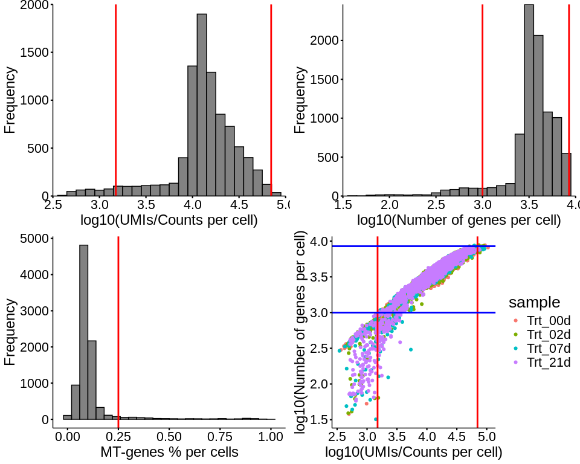<!-- -->

## Subset and preprocess the seurat object

``` r
srtobj_sub<-subset(srtobj, subset=percent.mito<0.25 & nFeature_RNA>1000 &nFeature_RNA<8500 & srtobj$nCount_RNA>1500 & srtobj$nCount_RNA<70000)

#Normalize and transform data
srtobj_sub<- NormalizeData(srtobj_sub, normalization.method = "LogNormalize", scale.factor = 1e6)

#Identifying highly variable features
srtobj_sub<- FindVariableFeatures(object=srtobj_sub, selection.method='vst', mean.function = ExpMean, dispersion.function = LogVMR, nfeatures=2000)

#Scale data, Shifts the expression of each gene, so that the mean expression across cells is 0. Scales the expression of each gene, so that the variance across cells is 1. This step gives equal weight in downstream analyses, so that highly-expressed genes do not dominate
srtobj_sub<-ScaleData(srtobj_sub, vars.to.regress=c("percent.mito","sample"))

#Performing linear dimensional reduction 
#PCA
srtobj_sub <- RunPCA(srtobj_sub, features=VariableFeatures(srtobj_sub),verbose=FALSE)
save(srtobj_sub,file="./srtobj_sub")
```

Plotting elbow plot, PCA and top variable genes

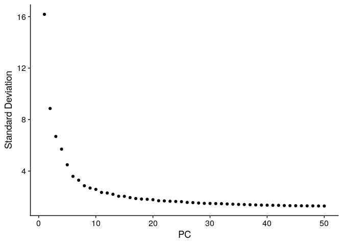<!-- -->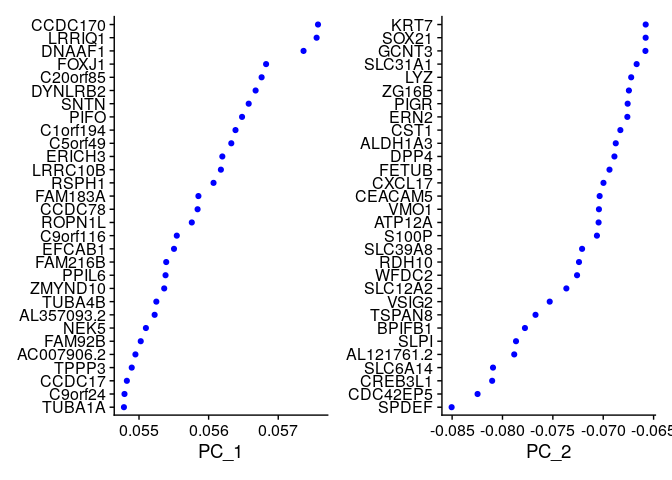<!-- --><!-- -->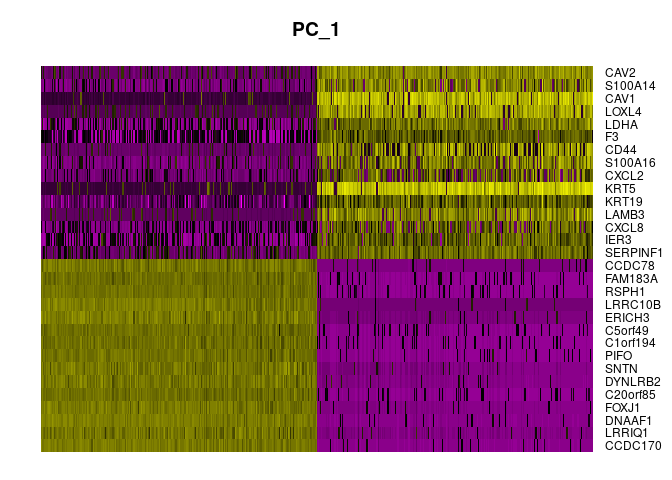<!-- -->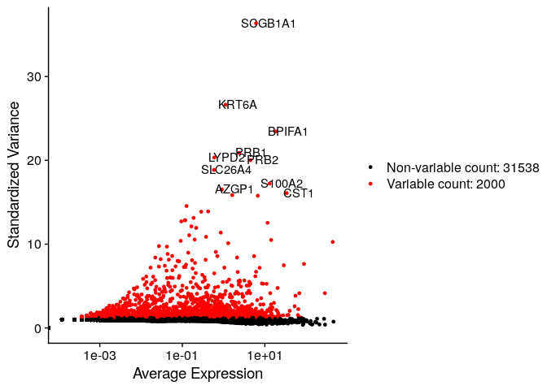<!-- -->
Clustering cells using various resolutions

``` r
#using dim 1:25 as per the ebbow plot
srtobj_sub<- FindNeighbors(srtobj_sub, reduction = "pca", dims = 1:25)
srtobj_sub <- FindClusters(srtobj_sub, resolution = c(0.2,0.4,0.6,0.8,1,1.5)) 
```

``` r
# Finding the number of clusters generated from each resolution
find_cluster_num <- function(df) {
  df <- data.frame(lapply(df, function(x) as.numeric(as.character(x))))
  max_values <- sapply(df, max, na.rm = TRUE)
  result <- data.frame(Max_Value = max_values)
  return(result)
}
result<-find_cluster_num(srtobj_sub@meta.data[7:12])
result
```

    ##                 Max_Value
    ## RNA_snn_res.0.2         6
    ## RNA_snn_res.0.4        10
    ## RNA_snn_res.0.6        13
    ## RNA_snn_res.0.8        16
    ## RNA_snn_res.1          17
    ## RNA_snn_res.1.5        23

Plot clusters using various resolutions using pca reductions.

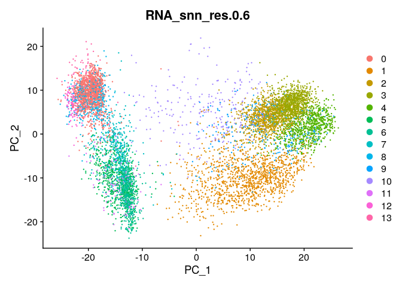<!-- -->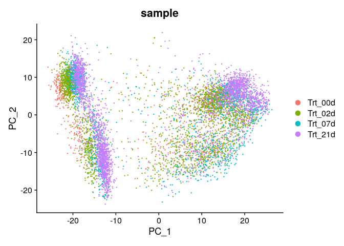<!-- -->

Run TSNE and UMAP

``` r
srtobj_sub<- RunTSNE(srtobj_sub, reduction = "pca", dims.use = 1:25,check_duplicates = FALSE,reduction.name = "tsne")
srtobj_sub<- RunUMAP(srtobj_sub, dims= 1:25, reduction.name = "umap")
```

Plot tsne and Umap grouped by samples

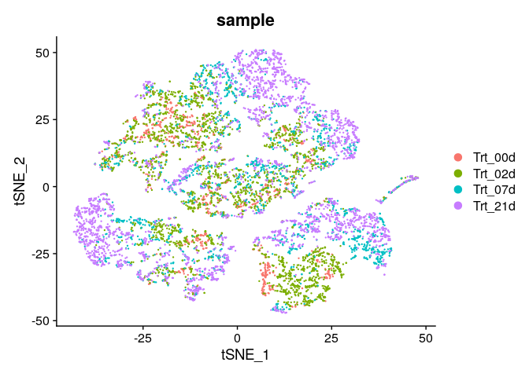<!-- -->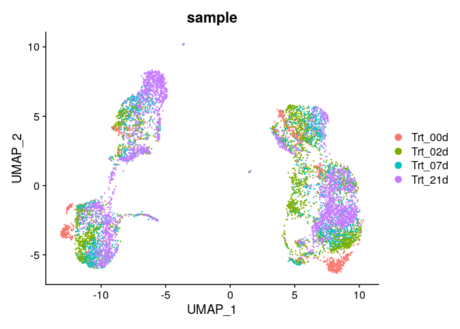<!-- -->

## Identifying cell types

Shown here is only unsupervised clusters identified by FindCluster
function in Seurat using resolution 0.6. Perform below steps for several
resolutions before selecting one for calling specific cell types.

Plot dimplot using UMAP reduction and resolution 0.6

``` r
DimPlot(srtobj_sub, reduction = "umap", pt.size = 0.5, group.by = "RNA_snn_res.0.6", label = TRUE) 
```

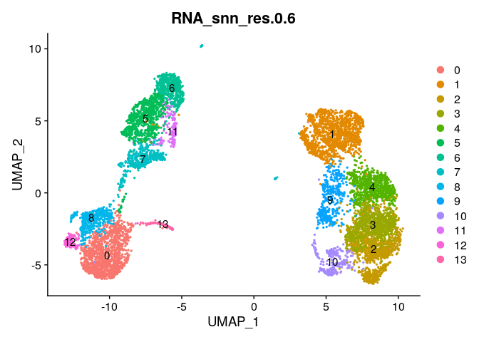<!-- -->

Finding cluster markers for all 13 clusters

``` r
#for resolution 0.6
Idents(srtobj_sub)<-srtobj_sub@meta.data$RNA_snn_res.0.6
temp_levels<-levels(srtobj_sub)
cluster_markers<-list()
for(l in 1:length(temp_levels)){cluster_markers[[l]]<-FindMarkers(srtobj_sub,ident.1=temp_levels[l],features=srtobj_sub@assays$RNA@var.features[1:2000])
names(cluster_markers)[l]<-temp_levels[l]
print(l)}
save(cluster_markers,file="./cluster_markers_res0.6")
```

Plotting heatmap of top 5 genes from each identified clusters

``` r
load("./cluster_markers_res0.6")
#extracting top 5 genes from each cluster
features2plot<-unlist(lapply(cluster_markers,function(x){rownames(head(x[x$avg_log2FC>0,],5))}))

#extracting data for selected genes
temp<-srtobj_sub@assays$RNA@data[match(features2plot,rownames(srtobj_sub@assays$RNA@data)),]

#averaging exp of selected genes by cluster number  
expr_marker_by_cluster<-matrix(NA,dim(temp)[1],length(levels(srtobj_sub$RNA_snn_res.0.6)))
for(i in 1:length(levels(srtobj_sub$RNA_snn_res.0.6))){
  expr_marker_by_cluster[,i]<-rowMeans(temp[,srtobj_sub$RNA_snn_res.0.6==levels(srtobj_sub$RNA_snn_res.0.6)[i]])}
colnames(expr_marker_by_cluster)<-levels(srtobj_sub$RNA_snn_res.0.6)
rownames(expr_marker_by_cluster)<-rownames(temp)

#plot heatmap
pheatmap(expr_marker_by_cluster, cluster_cols = TRUE, cluster_rows = FALSE,scale = "row", fontsize_row = 4)
```

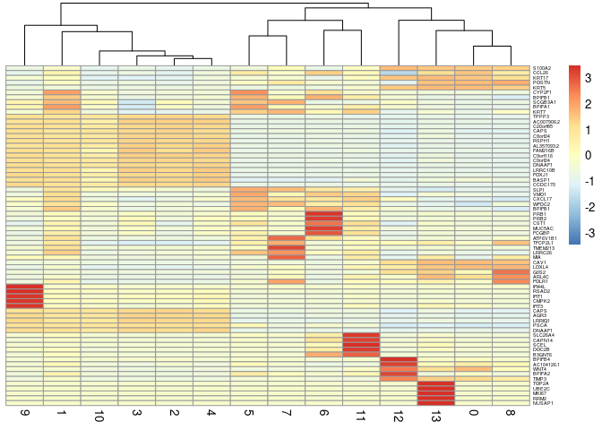<!-- -->
\### Plotting known cell types markers

1.  Plotting heatmap of all known or associated genes with specific cell
    types

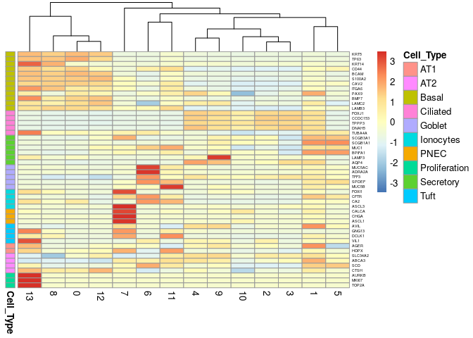<!-- -->

2.  Plotting a FeaturePlot using selected genes highly associated with
    cell types using UMAP reduction and resolution 0.6

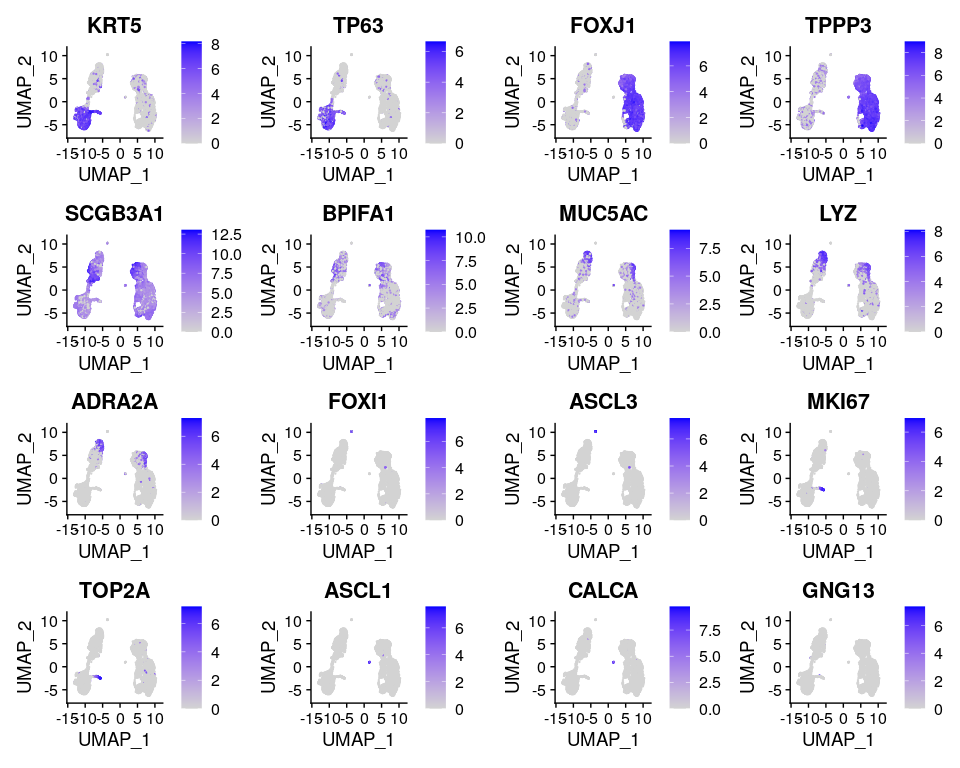<!-- -->

3.  Plotting a DotPlot of the selected genes grouped by cluster number.

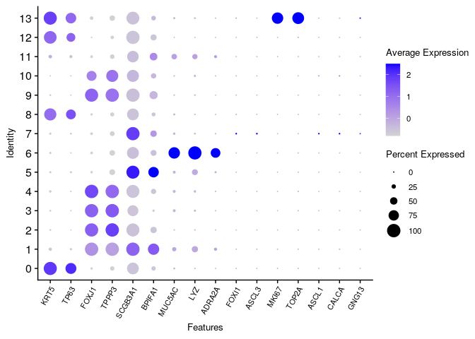<!-- -->

### Naming cluster ids with cell type

Using the information from cell type markers plots above, call each cell
type

Basal:0,8,12 ciliated:2,3,4,9,10 secretory:1,5,7,11 goblet:6, parts of 1
with MUC5AC exp proliferation: 13 PNEC: 7 with exp of CALCA, ASCL1
Ionocytes: 7 with exp of FOXI1, ASCL3 tuft:parts of 13 and 7

``` r
new.cluster.ids <- c("Basal","Secretory","Ciliated","Ciliated","Ciliated","Secretory","Goblet","Secretory","Basal","Ciliated","Ciliated","Secretory","Basal","Proliferation")
names(new.cluster.ids) <-levels(srtobj_sub)
srtobj_sub <- RenameIdents(srtobj_sub, new.cluster.ids)
srtobj_sub$Cell_type <- as.character(Idents(srtobj_sub))

#Adding additional cell types
MUC5AC_exp <- srtobj_sub@assays$RNA@counts[rownames(srtobj_sub@assays$RNA@counts)=="MUC5AC",]
srtobj_sub@meta.data$Cell_type[MUC5AC_exp >0 & srtobj_sub@meta.data$Cell_type=="Secretory"] <- "Goblet"

PNEC_exp <- srtobj_sub@assays$RNA@counts[rownames(srtobj_sub@assays$RNA@counts)=="ASCL1",]
srtobj_sub@meta.data$Cell_type[PNEC_exp >0 & srtobj_sub@meta.data$Cell_type=="Secretory"] <- "PNEC"

Ionocytes_exp <- srtobj_sub@assays$RNA@counts[rownames(srtobj_sub@assays$RNA@counts)=="FOXI1",]
srtobj_sub@meta.data$Cell_type[Ionocytes_exp >0 & srtobj_sub@meta.data$Cell_type=="Secretory"] <- "Ionocytes"

tuft_exp <- srtobj_sub@assays$RNA@counts[rownames(srtobj_sub@assays$RNA@counts)=="GNG13",]
srtobj_sub@meta.data$Cell_type[tuft_exp >0 & srtobj_sub@meta.data$RNA_snn_res.0.6 %in% c(13,7)] <- "Tuft"
```

Plot cell types clusters

``` r
DimPlot(srtobj_sub, reduction = "umap", pt.size = 0.5, group.by = "Cell_type") 
```

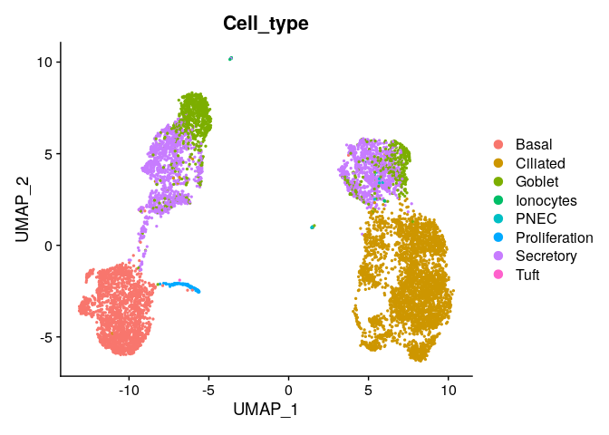<!-- -->

Plot proportion of cell types since total number of cells varies by
treatment group

``` r
#calculate the cell type proportion for each treatment group
data<-as.data.frame(prop.table(table(srtobj_sub$sample, srtobj_sub$Cell_type), margin = 1))
colnames(data)<-c("Treatment","Cell_Type","Proportion")

#Plot 
ggplot(data, aes(x = Treatment, y = Proportion, fill = Cell_Type)) +
  geom_bar(stat = "identity") +
  labs(title = "Cell Type Proportion per Treatment Group", x = "Treatment Group", y = "Proportion") +
  theme_minimal() +
  theme(axis.text.x = element_text(angle = 45, hjust = 1), axis.text = element_text(size=12))
```

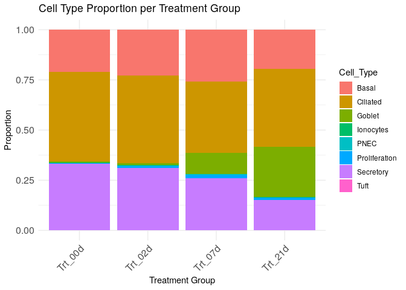<!-- --> It looks
like treatment increases number of goblet cells and decreases the number
of secretory cells.
